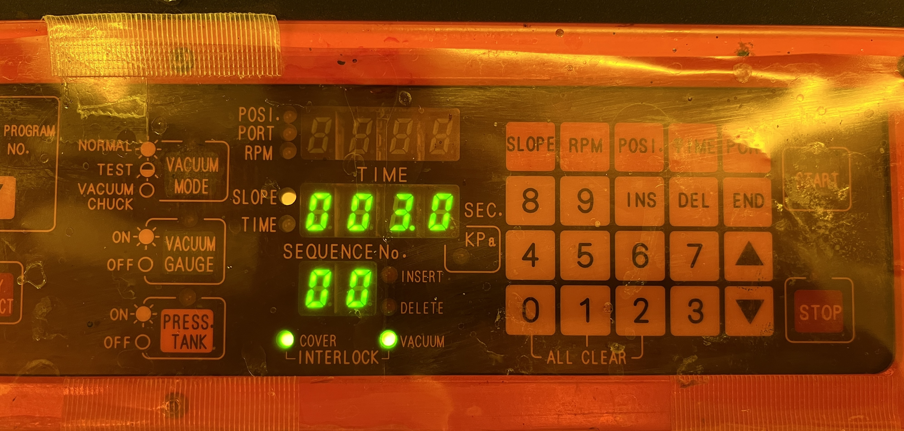
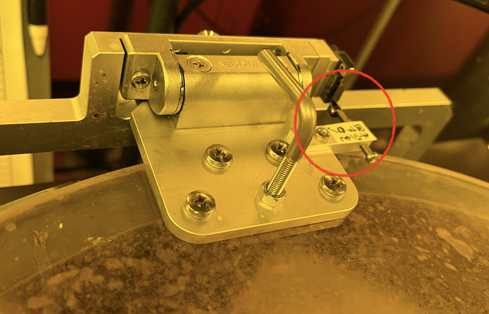
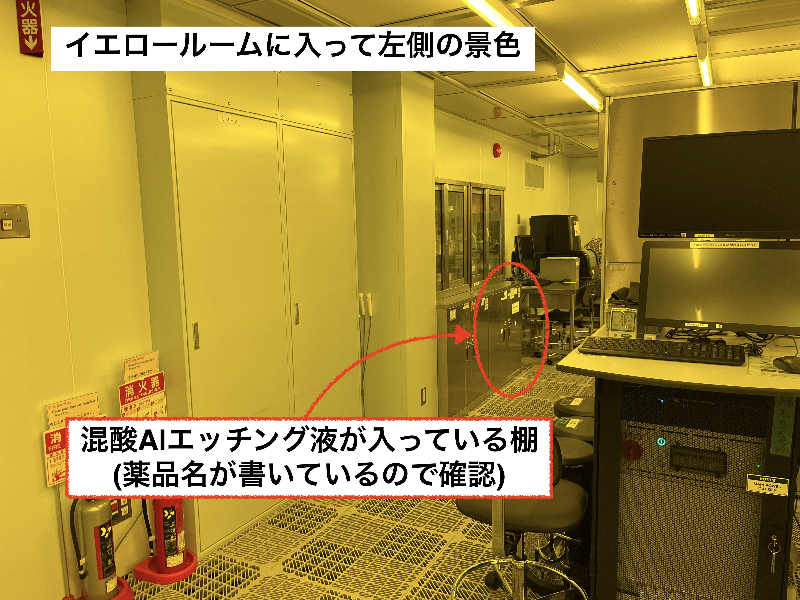

# Facilities


## 京都大学 ナノテクノロジーハブ拠点

- [設備利用管理システム](https://www.nanohub-kyoto.jp/main.php)
- [ナノハブお問合せフォーム](http://www.nanoplat.cpier.kyoto-u.ac.jp/contact/)
- [ナノハブ消耗品リスト](https://www.nanohub-kyoto.jp/data/doc/1711967681_doc_470.pdf)
- [ナノハブ装置マニュアル](https://drive.google.com/drive/folders/1HWYdyfOQb2V3P5IY4Pge9b7ozkyaZp3g)

### 安全教育と装置講習(オペトレ)

まず利用したい装置の装置講習を行う必要がある。
設備利用管理システムの左の ```安全教育と装置講習``` のタブを押し、安全教育依頼または装置講習依頼を行う。
さらにお問合せフォームで安全教育または装置講習の依頼を行う。
例えば以下のような内容で送ると装置担当者から日程などについての連絡がくる。

```
・お問い合わせ区分　安全教育・オペトレ
・課題ID　H24020
・お問い合わせタイトル　装置講習依頼
・所属機関名　京都大学大学院
・部署名　
・お名前　三野裕哉 様
・メールアドレス　<mail address>
・ご相談内容　
お世話になっております。京都大学の三野です。
以下の3つの装置講習をお願いしたいのですが、いつ頃であれば可能でしょうか。

[B19] ダイシングソー
[B21] 紫外線照射装置
[B22] エキスパンド装置

シリコンウエハーにニオブとアルミを蒸着したものをダイシングしたいと考えています。
```

### 施設の利用予約

- の左の ```装置予約``` から予約を行う。(2営業日前に装置の予約が必要)
- 評価項目としては以下のようなことを記入する
    - 基盤のサイズ・素材
    - ベタ膜の場合は成膜されている金属
    - 加工内容(レジスト塗布・フォトリソ・EBリソ・現像・エッチングなど)
- 評価項目の例
    - 2枚のシリコン基板 (4インチ・525µm厚) にそれぞれ Nb と Nb+Al が成膜済み。各サンプルにレジストの塗布 (THMR-iP1800EP)・フォトリソ・現像・エッチング(Nb は CF4 でドライエッチング、Al は混酸Alエッチング液でウェットエッチング)・ダイシング
    - サファイヤ基板 (4インチ・625µm厚) に二層レジストの塗布 (PMGI SF5+ZEP)・EB直接描画・現像

## 武田クリーンルーム

## OIST(沖縄科学技術大学院大学)

### 利用登録

- 「承諾書 ([英語版](https://groups.oist.jp/system/files/Letter%20of%20agreement_form_1_ENG.docx)もしくは[日本語版](https://groups.oist.jp/system/files/Letter%20of%20agreement_form_1_JPN.docx))」をご準備ください。(この書類にはあなたの所属長のサインが必要となります)
- [Application Form](https://forms.office.com/Pages/ResponsePage.aspx?id=jfvA2Fa7u0SfSsWOdGVlLnlRtciJeBZCmQlvXg03jtpURDJTRko1RlZYNzBSTEFGRVFaOFdWOTFRSy4u)に承認済み【コンサルテーションID】を含めた全ての必要事項をご入力の上、Application form内のGigaCCリンクより「承諾書」PDFと併せてご提出ください。
- 学外利用の方が複数名いらっしゃる場合、代表者以外の方には同じく承認済み【コンサルテーションID】をご入力の上、[利用者誓約書 (メンバー用)](https://forms.office.com/Pages/ResponsePage.aspx?id=jfvA2Fa7u0SfSsWOdGVlLnlRtciJeBZCmQlvXg03jtpUMTJRWlRHT1ZSMlpHWURVNExBUDZMUzhKWC4u)のご提出をお願いいたします。
- 登録が終わると e-training の案内が来るので、初回利用時までに終わらせておく。

### 利用の流れ

- 利用するごとに、[Request form for On-campus visit / Service / sending Samples | 学内訪問・サービス・サンプル送付申込書](https://forms.office.com/r/mWLANqqEDx) を提出する


## ナノハブ

### マニュアルスピンコータ

- 使用前のレジストの重量を測定する。(冷蔵庫に入っているレジストは30分くらい放置して室温に戻す)
- マニュアルスピンコータが設置されているドラフトチェンバーの照明・排気ファンの電源をつける
- マニュアルスピンコータのポンプの電源を入れる
- 手袋(アルミホイルが収納されている引き出し)と保護メガネをつける
- WIPER をレジストが飛び散りそうな位置に敷く
- 台を設置する(真後ろの机の下に並べられている)
- ウエハーを設置する
- ```VACUUM MODE``` を押して真空を引いてウエハーが固定されているか確認する
- レジストをつける
- 蓋を閉めて、写真のように ```COVER``` と ```VACUUM``` が緑色に点灯していることを確認する
- レシピを選択する
    - まずは ```PROGRAM NO.``` を矢印キーで選択する。
    - 右の矢印キーで各 step に設定されている動作を確認する。

{ width="50%" }

!!!warning
    ```START``` を押したにも関わらず、すぐに止まってしまう場合には ```VACUUM``` と ```COVER``` が点灯しているか確認する。
    特に蓋は手前に位置がずれていると閉じているか認識してくれない。
    写真の赤で囲われている部分で蓋が閉じているか認識しているため、蓋を少し奥側にずらすとうまく認識してくれるかもしれない。
    分からなければ近くの技術職員に聞いて見てもらう。

{ width="50%"}

#### 立ち下げ

- 敷いていた WIPER を隣の乾燥カゴに入れる
- アセトンでマニュアルスピンコータの中を拭く(蓋はエタノールで拭く)
- マニュアルスピンコータの使用簿の記入
- 使用後のレジストの重量を測定する
- レジスト使用簿の記入

### 厚膜フォトレジスト用スピンコーティング装置　(A07)

HMDS 処理を行うための装置で、レジストを剥がれにくくする。

!!!warning 
    真空を引くためのポンプが動いていることを確認する。  
    コンセントのスイッチは壁側だが、ポンプ本体のスイッチを切っている人がたまにいる。  
    ポンプが動いているかどうか音を確認する。(もしくは横のスイッチもちゃんと付いているか確認する)  

### レジスト塗布装置 (A08)

#### レシピ

| レシピ番号 |  変更点  |       説明       |     レジスト厚み     |
| ---------- | -------- | ---------------- | -------------------- |
| 25         | -        | nanohub official | 1 $\mu \mathrm{m}$   |
| 12         | 1000 rpm | 初回オペトレ     | 1.3 $\mu \mathrm{m}$ |

#### 消耗品

- THMR-iP1800EP : 4.33 g/回

#### 立ち下げ

- ステンレスカバーをはずして有機ドラフトでアセトンで掃除
- アルミホイルが入っている棚に手袋も入っている
- WIPER は乾燥カゴ、手袋はプラゴミへ

### ウェットエッチング

Al の蒸着された膜をエッチングするためには混酸 Al エッチング液を用いたウェットエッチングを行う。
ドラフトはナノハブのクラス100のイエロールーム入って右手の酸アルカリ用ドラフトを使用する。
混酸 Al エッチング液はイエロールームの入り口の左側の棚にある(レジストなどの棚とは別のところ)。

{ width="50%" }

- ドラフトチェンバーの照明・排気ファンの電源をつける
- 混酸Alエッチング液を注ぐときは厚手の手袋をつける
    - タンクが結構大きいので、満タンに入っているときには入れ物を口の近くに置き、少しずつ傾けながら注ぐ。
- 入れ物を 3 つ用意し、1つは混酸Alエッチング溶液用、もう2つはリンス用として水を入れる。
    - ナノハブでは水を出しっぱなしにして直接突っ込んで洗う(混酸Alエッチング溶液は結構ネバネバしている)
- 基準は 1 - 2 分だが、Al の下の例えば Nb の色が見えたら OK
- 混酸Al エッチング液を直接入れたものだけ廃液タンクに
    - 他は共洗いしてドラフトに捨てる
- 入れ物は適当にマニュアルスピンコータの近くのデシケータから(洗って -> wiper で拭いて -> 入れておく)

### マスクレス露光装置(A21)

!!!info
    Load job で以前利用した job を読み込むことができるが、Restart Job を押して job number を更新する必要がある (Design などは読み込まれるが、Dose や defocus が読み込まれるかは直前の job を load した場合のみ？)

### 多元スパッタリング装置 (B02)

[装置マニュアルのスキャン](https://drive.google.com/file/d/1CDGH-UQ3srnKDo0zAdyyckcSyTnAlaUv/view?usp=drive_link)

B01 も多元スパッタリング装置だがターゲットは固定で、B02 は要望によってターゲットの交換を行うことできる。

#### 装置予約

- ターゲットの交換は技術職員が行うため、装置予約の前に諫早さんにメールでターゲットの連絡を行う。
- 窒素を使用する場合は酸素との交換が必要になるため、装置担当者に事前連絡

#### 装置準備

- 成膜面を下に向けて、サンプルを基板トレーに設置

!!!warning
    - 手袋の着用を忘れずに
    - 装置の起動・停止は不要 -> 触るのはロードロックチェンバー(LL室)・オペレーションパネルくらい
    - 基板トレーに何も乗せずにスパッタリングをしないこと
        - ウエハーを半分に割ってから置いたりしないこと
        - 例えば3連トレーを用いる場合に使わない場所があってもダミーウエハーで埋める

#### レシピの作成

レシピは 11 番まで標準のものが用意されており、12 番以降はユーザーで登録したものが用意されている。
京都の量子チームでは主に以下のレシピを使用する。

| レシピ番号 | Target |       説明       |   成膜レート    |
| ---------- | ------ | ---------------- | --------------- |
| 3          | Al     | 標準レシピ       | 5.2 (5.7) nm/分 |
| 7          | Ti     | 標準レシピ       | 5 nm/分         |
| 35         | Nb     | CMB の武藤レシピ | 5.75 nm/分？(17分24秒で 100 nm?)    　|


- T/S : Target と Sample の距離 (125 mm に設定)
- Rotate speed : 10.0 rpm
- TGT SEL : どの番号にどの Target が設置されているかボードに書いてあるので、成膜したい金属に合わせて調整する。

#### 自動運転

!!!warning
    - 基板トレーが LL 室に戻ってきた際に場所がずれている可能性があるため、次の充填の際にちょっと揺らしてみて確認する
    - 緊急時は非常停止 (EMO) スイッチを押して対処
    - 操作中に問題やトラブルが発生したときは、装置担当者(担当者不在の場合は他の技術職員)に連絡

#### 装置使用後

- 標準レシピで HEAT を ON にしたら最後に OFF に戻す

!!!warning 装置使用後
    - 最後ウェハーを取り除いたら真空を引いた状態で終了する

#### 消耗品

- 入り口付近の PC でターゲットの使用量を excel ファイルで計算する。


### ダイシングソー(B19)

!!!warning
    ダイシングをするときには、表面を適当なレジストで保護しておく必要がある。
    ナノハブでは保護用のレジスト塗布が必要な場合、マニュアルスピンコータで OFPR-800LB(23CP)等を塗布する。
    塗布後のプリベークは110度で300秒行う。

- デザインについて
    - デザイン名の最初に課題IDをつける
    - <u>**ワークサイズはダイシングする長さを決めるので注意**</u>

- テープマウンタ
    - 粘着シートを机の下から取り出し、保護フィルム(白くて粘着面がない方)を下にして置く
        - 標準と高粘着があるが、とりあえず標準を使用する
    - ダイシングフレームを引き出しから取り出し、金属枠に書いてある文字が保護フィルム側になるように置く
    - 剥離テープ(白い方)を下にして、粘着テープ(透明な方)をギリギリまで剥がす
    - サンプルとダイシングフレームを白いテープの上に置く(サンプル面が剥離テープ側に)
    - サンプルが中心にくるように置く(サンプルに圧力がかかっても問題ない場合は、表面を保護フィルム側に)
    - ローラーを使って粘着シートが金属枠とサンプルに隙間なくくっつくように
        - ここでちゃんと粘着シートとサンプルがくっついていないとダイシングで吹っ飛んでいく
    - 金属枠の外側にそってシールを切っていく(直接金属枠の上をカッターで切らないように)

- ブレードダイシング
    - ブレードが問題なくワークをダイシングできているときには ```スピンドル電流値(A)``` が 1.270 付近になっている。
        - 例えば刃が欠けたりすると空転するので、```スピンドル電流値(A)```がアイドル時と同様の 0.9 付近になる。
    - 最後にエタノールでチャックテーブルの上やブレードの周辺を拭く

#### 消耗品

- ブレードダイシングに使ったブレードの時間
- 粘着テープを何pcか

### エキスパンド装置(B22)

- Air のバルブはダイサーの裏にある
- ダイシングフレームをつけたまま装置に置く
- まずは下のフレームに白のリングを設置し、上のフレームには黒のリングを設置する
- 持ち帰り用の弁当箱みたいな箱が机の下にあるので、紫外線照射後に入れて持ち帰る(その中にリングも入っている)
- ケースは次回利用時に返却する(使用したリングとケースの数は記録する)

### 紫外線照射装置(B21)

- レシピは No.3 を使用するが、あまり強くはないため <u>**3 回くらい照射する**</u>

## OIST

消耗品は利用料に含まれているので、とくに報告の必要はない。(2024年12月時点)

### HF洗浄

- (2024年12月時点では) Lab 5 のドラフトのある部屋の一番奥に配置
- HF で Nb を綺麗にする(Al はすぐ溶けてしまう)
- 手袋は薬品耐性のある使い捨てのものを導入(HF 溶液を捨てる容器の横に捨てる)

- サファイア基盤はフッ化水素での洗浄はいらないが、NMP ? とかで洗浄する(有機物を溶かすものならなんでも？)

- フッ化水素での洗浄
    - OIST では以下をまずは装備する
        - ブーツカバー
        - ニトリル手袋
        - エプロン
        - フェイスカバー
        - 厚手手袋 (Lab5 に移動したあとは使い捨ての手袋に変化)
    - 器を3つ用意して水を入れる
    - フッ化水素を数滴水に垂らして薄める (Lab5 に移動したあとはすでに薄めたものが用意されている)
    - フッ化水素用のピンセットで2秒くらい浸してすぐに水に入れる(底に蓋みたいなものを入れておくと掴みやすい)
        - 時間を測って次の器に入れる

#### 片付け
    
- フッ化水素を廃液タンクに入れていく
- まずは HF を入れた容器の中身から捨てる
- 次に洗った容器から水を HF を入れていた容器に移して共洗い
- 最後に空いた容器に水を入れてピンセットなどを洗う

### Plassys (斜め蒸着)

#### 斜め蒸着機の操作について

1. 下の電源をつける
2. 一回空撃ちする(例えばAl を蒸着するのであればAl 100nm ベタ膜)
3. サンプルホルダーに配置する → Vent で窒素充填で大気圧に → サンプルホルダーを反対向きにして設置 →　Pump で真空にして Transfer で入れるための扉を開ける → バーで pin をロックしてゆっくり押し込む →入り切ったら unlock してバーを抜く →　Pump ボタンを押して閉めて真空に → Recipe を選択して走らせる(我々が触るボタンは Loadlock Xfer mode の 3 つのボタンのみ)
4. Recipe は PanelControl → Process Editor から recipe を選択して走らせる

Recipe が終了したら log として excel ファイルに残しておく
1. Layer 1 - 3 までの記入欄しかないので、1 回目と 2 回目に JJ の情報を、3回目に上下からの蒸着の情報を入れる (3 回目は上下からなので milling の時間などは 2 倍で記入)
2. 蒸着している際の pressure は current が高くなっているところの時間を見つけて、そこでの pressure を記入する
    1. ```I/O history``` -> ```Evap``` などから電流や圧力がわかる
3. 温度は RT (Room temperature) を入れる

#### レシピの作成

- Recipe の変更は drag & drop で行う。(上にいくつか使えそうなものが並んでいる)
- Recipe の名前のうち、? が実際に数字を埋めるところ
- カセットテープみたいなボタンを押して Save を忘れずに
- 選択した状態で delete ボタンを押すと消せる
- log file の選択は ```all files``` に変更し、同じ名前のものから ```.prj``` だけ消すと名前を簡単に変更できる


#### 45度マンハッタンの作り方
- pad の酸化膜をアルゴンミリングで取り除きたい
- 先にアルゴンミリングをすると基盤が傷つくし、あとだと JJ も吹き飛ばしてしまう
- 両立するために JJ の角度をずらして先につけて、アルゴンミリングを斜めから行う(JJ のレジストの壁が JJ を守る)
- まずは斜めに Al → AlOx → Al で JJ 結合を作成する
- TiN の pad と JJ 結合を繋ぐために上下から斜め蒸着する(両側からやるのは階段上になっているからそれを埋めるため)
- TiN の pad 上に酸化膜ができているので、それをなるべくアルゴンミリングで吹き飛ばす(パッドを大きくすれば十分ショートするしアルゴンミリングはいらないのではというシカゴ大学の主張)
- アルミ蒸着機では台を回したり斜めにすることで蒸着角度を変える

#### Trouble shooting
- 途中で warning が出た時
    - severity 0 の場合は process を止めずに走り続ける
    - severity 1 の場合は user に続けて良いか確認を取る画面が現れる (continue で続ける)
- チェンバーの圧力計がおかしくなった時の対処方法
    - Oxid Chamber Fine Pumping を一度 Vent して窒素導入されたら圧力が上がったことを確認し、すぐに Pump する


